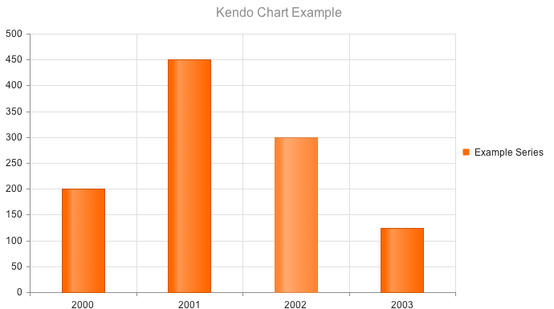
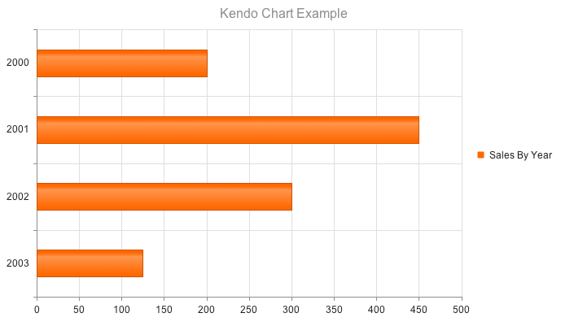

## Column Chart

The Column Chart is the default chart rendered if a "_type_" is not specified.

    $("#chart").kendoChart({
        title: {
            text: "Kendo Chart Example"
        },
        series: [ {
            name: "Example Series",
            data: [200, 450, 300, 125]
        } ],
        categoryAxis:{
            categories: [ 2000, 2001, 2002, 2003 ]
        }
    });

## Bar Chart

Setting the "type" property on the "series" object to "bar" renders horizontal bars.

    $("#chart").kendoChart({
        title: {
            text: "Kendo Chart Example"
        },
        series: [ {
            type: "bar",
            name: "Example Series",
            data: [200, 450, 300, 125]
        } ],
        categoryAxis:{
            categories: [ 2000, 2001, 2002, 2003 ]
        }
    });

