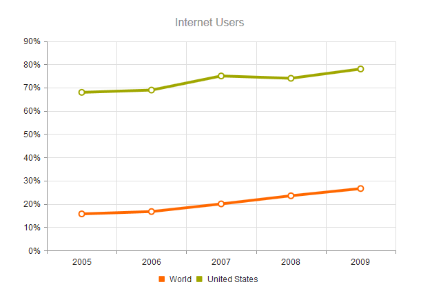

## Line Charts

Use "line" series type to create a line chart. The chart orientation can be changed using "verticalLine".

    $("#chart").kendoChart({
        title: {
            text: "Internet Users"
        },
        legend: {
            position: "bottom"
        },
        seriesDefaults: {
            type: "line"
        },
        series: [{
            name: "World",
            data: [15.7, 16.7, 20, 23.5, 26.6]
        }, {
            name: "United States",
            data: [67.96, 68.93, 75, 74, 78]
        }],
        valueAxis: {
            labels: {
                format: "{0}%"
            }
        },
        categoryAxis: {
            categories: [2005, 2006, 2007, 2008, 2009]
        }
    });

This configuration produces the following line chart:

## Dash type

The default line type is solid. The following dash styles are available through the "dashType" option:

For example:

    series: [{
        name: "World",
        data: [15.7, 16.7, 20, 23.5, 26.6],
        dashType: "dot"
    }]

