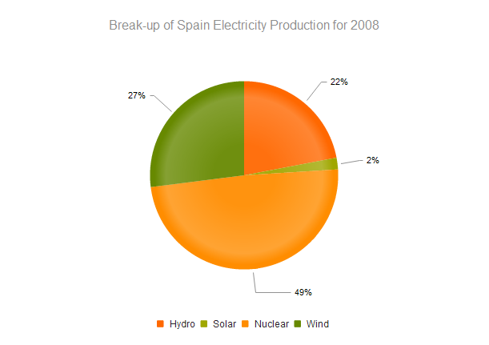
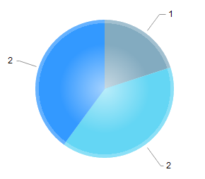
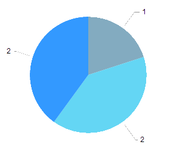

## Pie Charts

Pie charts are suitable for displaying data points as a proportion of the whole.

In order to create a pie chart, define a single series with type "pie". Additional series are not supported.

Each data point is an object that specifies the point value, category label and other properties.

    $("#chart").kendoChart({
        title: {
            text: "Break-up of Spain Electricity Production for 2008"
        },
        legend: {
            position: "bottom"
        },
        seriesDefaults: {
            labels: {
                visible: true,
                format: "{0}%"
            }
        },
        series: [{
            type: "pie",
            data: [ {
                category: "Hydro",
                value: 22
            }, {
                category: "Solar",
                value: 2
            }, {
                category: "Nuclear",
                value: 49
            }, {
                category: "Wind",
                value: 27
            } ]
        }]
    });

This produces the following Pie Chart.

## Effects Overlay

Each segment has a transparent effect overlay that adds depth to the two-dimensional shape. The overlay transparent gradient is configurable.

    $("#chart").kendoChart({
        series: [{
            type: "pie",
            overlay: {
                gradient: "none"
            }
        }]
    });

The following gradient options are available:

*   roundBevel - default

*   sharpBevel

*   none

