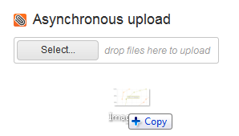

Users can select files by dropping them over the Upload.

This feature is only available in [async mode](modes#asynchronous-mode) and requires a supported browser.

## Uploading files with drag and drop

1. The drop zone will appear when a file is dragged over the browser window.  
2. The drop zone will be highlighted when the mouse is over it.  
3. Releasing the file over the drop zone will add it to the upload queue.  

##  Drop zone visibility

The drop zone is not visible by default. You can override this behavior with the following CSS rules:

