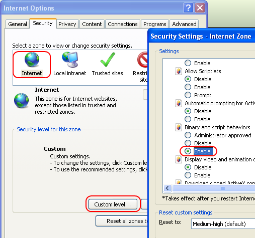

## Problem: The "Select..." button is partially visible and has no text

The Upload uses an opacity filter to overlay the default file input's Select button.
This filter is implemented as an ActiveX control in IE versions 8 and below.
As such, it is subject to security settings and can be accidentally disabled.

Sample image of an affected component:

### Suggested actions

Set the following option to "Enable" in Internet Explorer: "Internet Options -> Security -> Internet (or Local intranet) -> Custom Level -> Binary and script behaviors"

## Problem: Incorrect behavior in the Opera browser

### Symptoms include:

* The `success` is fired when the file upload fails
* The server response cannot be accessed in the `success` event
* The `success` event fires before the upload is complete

### Suggested actions

Turn off Opera Dragonfly. This debugging tool will interfere with the upload by firing an extra Load event for the IFRAME.

## Problem: How to see a message logged in the console

When a server error occurs the complete server response is logged in the console.
The console is accessible in a manner specific for each browser:

*   Internet Explorer - Open the developer tools (F12) and choose the Script tab. The console is visible on the right.
*   Firefox - Install [Firebug](http://getfirebug.com/downloads) and enable the Console tab.
*   Chrome - Open the JavaScript console (Ctrl + Shift + J).
*   Safari - Enable the Develop menu from the Preferences / Advanced dialog. Open the error console from the Develop menu.
*   Opera - No usable error console available because of a bug in Opera Dragonfly.
*   Any browser - Use a debugging proxy like [Fiddler](http://www.fiddler2.com/fiddler2/) or [Charles](http://www.charlesproxy.com/) to obtain the server response.
