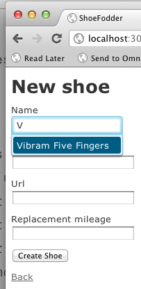

# Using Kendo with Ruby on Rails

In this article, I'll show you how to get up and running with Kendo UI in Ruby on Rails applications. In particular, I cover using the [kendoui-rails Gem][1], though the concepts in this article are the same if you are using a fully-licensed version of Kendo UI.

### `kendoui-rails`: A Ruby Gem for Rails Apps

Ruby on Rails developers love speeding up common development tasks, and we do too. As such, we created the [kendoui-rails][1] gem to get Kendo UI into your Rails apps with little manual effort on your part. If you're using the Rails 3.1+ [Asset Pipeline][4], you can get up and running with Kendo UI with two simple commands. Even if not, or if you're using an older version of Rails, this gem will get you rolling with Rails faster.

If you want the sources, check it out over at [http://github.com/telerik/kendoui_rails][2], and feel free to fork it, send us pull-requests, enter issues or offer any other kind of feedback you think we need. 

> The kendo-rails gem provides a GPLv3-licensed version of the latest major release of Kendo UI Web. If you own a licensed version of Kendo UI DataViz or Kendo UI Mobile and you want to use the Gem, you can create a private fork and extend the pipeline references below.

### Installing the `kendoui-rails` Gem

To start using rails with Kendo UI, create a new Rails application:

	$ rails new shoe_fodder
 	$ cd shoe_fodder

Then, edit your Gemfile by adding a reference to the gem, just after `gem 'jquery-rails'`:

	gem 'kendoui-rails'

> Much like Kendo UI depends on jQuery, kendoui-rails depends on the jquery-rails gem

Now, return to your console and run `bundle install.` Check that wall of text that Bundler sends your way to confirm that kendoui-rails has been properly installed.

### Installing Kendo UI Assets

The kendoui-rails Gem includes a custom install generator that will make sure you have all the JavaScript and CSS you need to get going with Kendo. To use it, type the following in your console:

	$ rails generate kendoui:install

Depending on your Rails version and environment, one of two things will happen in this step: 

* If you're using Rails 3.1 or later, and have the new asset pipeline features enabled (they are, by default) the Gem will add the appropriate references to your `app/assets/javascripts/application.js` and `app/assets/stylesheets/application.css` files:

		// app/assets/javascripts/application.js
		//= require kendo/kendo.all.min

		/* app/assets/stylesheets/application.css */
		*= require kendo/kendo.common.min
		*= require kendo/kendo.default.min

* If, on the other hand, you're using Rails 3.0 or previous, or have the asset pipeline disabled, the Gem will manually copy all the needed assets into the `public/` folder of your app. From there, you'll need to add the proper `<link>` and `

Next, I'll start up my server

	$ rails server

And finally, open up a browser at `localhost:3000/shoes/new`. 

 

Using Kendo UI with Rails in your apps is simple with the kendo-rails gem. If you want to view a recorded walk-through of this process, you can check out the embedded video below, or [watch it over on our YouTube channel][3] (Note: be sure to watch in full screen mode to get all of the detail.)

### See the Gem in Action

<iframe width="560" height="315" src="http://www.youtube.com/embed/7_KlxiCMQe8" frameborder="0"></iframe>

### Links

* [kendoui-rails on GitHub][2]
* [kendoui-rails at RubyGems.org][1]
* [Screencast on YouTube][3]

[1]: https://rubygems.org/gems/kendoui-rails "kendoui-rails Gem"
[2]: https://github.com/telerik/kendoui_rails "kendoui_rails on GitHub"
[3]: http://www.youtube.com/watch?v=7_KlxiCMQe8 "Demo of the kendoui-rails Gem on YouTube"
[4]: http://guides.rubyonrails.org/asset_pipeline.html "Rails 3.1 Asset Pipeline"
[5]: /api/web/autocomplete "AutoComplete Reference"