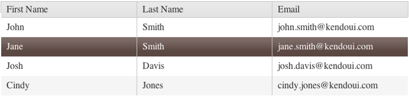
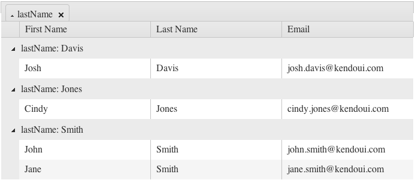
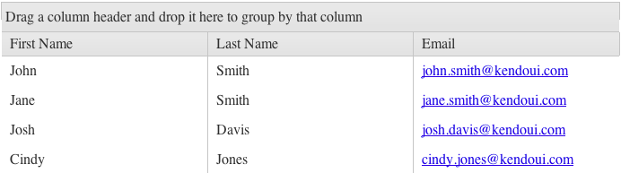

The Kendo UI Grid is a powerful piece of the Kendo UI framework and an essential part of almost any user interface.  Kendo UI provides a grid component that is quick to setup and packed with features like sorting, grouping, paging and editing.

## Creating A Grid

To create a Kendo UI Grid, you begin with either an empty div, or an HTML table.  If you create your grid with an empty div, you will be describing it’s layout in the JavaScript.  If create the grid with a table, you can describe the grid layout entirely in the HTML of the table.

### Grid Creation From A Div Element

First start with an empty div that has an ID.
    

Now turn the div into a grid by selecting the div with a jQuery selector, and calling the kendoGrid() function.  iince the grid is being created off of an empty div, you must specify the column layout by passing an array of column definition objects to the columns option of the grid.
    $("#grid").kendoGrid({
        columns: [ { title: "First Name", field: "firstName" },
                   { title: "Last Name", field: "lastName"}
                   { title: "Email", field: "email" } ]
    });

Each column object has the following properties:

1.  **title**: This is the text you want to appear as the column header
2.  **field**: The field in the data set that this column should be bound to.
3.  **template**: You can specify a template for the grid column to display instead of plain text.
4.  **width**: The desired width of the column.

### Grid Creation From An HTML Table

Add an HTML table.  Specify the table header.  Each of `th` elements you specify will become a column and the text will become the column header.
    <table id="grid">
         <thead>
            <tr>
                <th data-field="firstName">First Name</th>
                <th data-field="lastName">Last Name</th>
                <th data-field="email">Email</th>
            </tr>
         </thead>
    </table>

The table can now describe the entire structure of the grid. The field that the column is bound to in the data set is specified in the `data-field` attribute of each `th` element.

Since the layout of the grid is defined by the HTML it’s only necessary to call the kendoGrid() function to create a grid.

    $("#grid").kendoGrid();

At this point, either way the grid was created you will have an empty grid.

### Data Binding - Local

The next step is to bind the grid to data.  The grid can be bound to local data very simply by setting the `dataSource` option of the kendoGrid object.
    var people = [ { firstName: "John",
                     lastName: "Smith",
                     email: "john.smith@kendoui.com" },
                   { firstName: "Jane",
                     lastName: "Smith",
                     email: "jane.smith@kendoui.com" },
                   { firstName: "Josh",
                     lastName: "Davis",
                     email: "josh.davis@kendoui.com" },
                   { firstName: "Cindy",
                     lastName: "Jones",
                     email: "cindy.jones@kendoui.com" } ];

     $("#grid").kendoGrid({
         dataSource: people
     });

### Data Binding – Remote

The grid can bound to remote data by specifying the dataSource option.  The data source can either be created outside of the grid or passed in.  If you have multiple widgets bound to the same set of data, you would create the data source as an object that you could reference in different widgets.  if the grid is the only item bound to the data, it makes more sense to simply create it inline.
    $("#grid").kendoGrid({
         dataSource: {
             transport: {
                 read: "/Home/People.json"
             },
             schema: {
                 data: "data"
             }
         }
    });

#### Auto Binding

The grid is set to automatically bind to data by default, meaning it will cause the data source to query as soon as it’s loaded and data will be loaded into the grid.
This can be disabled by setting the `autoBind` option of the grid to `false`.
    $("#grid").kendoGrid({
        autoBind: false,
        // other configuration
    });

## Grid Size

By default, the grid will expand to fit the width and height of its container and contents.  You can control the height of the grid by specifying a static pixel value.
    $("#grid").kendoGrid({
        height: 100,
        // other configuration
    });

Setting CSS width properties for the grid itself, or the parent container of the grid controls the width of the grid.

### Making the Grid 100% high and auto resizable

In order to configure the Grid to be 100% high and resize together with its parent element on browser window resize, the following Javascript code must be used:

    $(window).bind("resize", function() {
        var gridElement = $("#grid"),
            newHeight = gridElement.innerHeight(),
            otherElements = gridElement.children().not(".k-grid-content"),
            otherElementsHeight = 0;

        otherElements.each(function(){
            otherElementsHeight += $(this).outerHeight();
        });

        gridElement.children(".k-grid-content").height(newHeight - otherElementsHeight);
    });

The above script will be executed as window resize event handler. The Grid `div` should have a 100% height style applied and its default borders should be removed.
Note that elements with percentage height require a parent element with an explicit height.

## Features

### Scrolling

Scrolling is enabled by default on the grid, but can be turned off by setting the `scrollable` option to `false`.

#### Disable scrolling in the grid

    $("#grid").kendoGrid({
        scrollable: false,
        // other configuration
    });

#### Enable virtual scrolling

Virtual Scrolling will load in data from the remote data source as you scroll down the grid.

    $("#grid").kendoGrid({
        scrollable: {
            virtual: true
        },
        // other configuration
    });

### Selection

Selection can be enabled in the grid simply by setting the `selectable` option to `true`.

This will by default enable single row selection in the grid.
    $("#grid").kendoGrid({
        selectable: true,
        // other configuration
     });

The `selectable` option can also be set to the following values:

#### Default. Enables single row selection
The same as `selectable: true`

    $("#grid").kendoGrid({
        selectable: "row",
        // other configuration
    });

#### Enable selection of individual cells within the grid.

    $("#grid").kendoGrid({
        selectable: "cell",
        // other configuration
    });
#### Allow users to select multiple rows in the grid.

    $("#grid").kendoGrid({
        selectable: "multiple row",
        // other configuration
    });

#### Enables multiple cell selection.

    $("#grid").kendoGrid({
        selectable: "multiple cell",
        // other configuration
    });

When multiple selection is enabled, it is possible to select multiple rows/cells by dragging the mouse cursor to select them similar to the way you would select a block of text.

### Paging

The paging setting within the grid is controlled by the `pageable` option. The grid will additionally need to know how many records to display on each page and the total number of records in the data set.  Specify the `pageSize` on the data source and the field in the dataset that will contain the total count of records.

    $("#grid").kendoGrid({
         pageable: true
         // other configuration
    });

It is often preferred to do paging operations on the server to keep from including too much data in the HTML, which can slow down page performance.  To accomplish this, set the `serverPaging` option on the data source to `true`.

In the instance that you decide to use server paging, you must be prepared to handle the requests to the server and respond appropriately.  The data source will send the following default parameters to the server when `serverPaging` is enabled.

**top**: The number of records to send back in the response.

**skip**: The number of records to skip from the start of the dataset.

For instance, if you wanted page 3 of a 60 record dataset at 10 records per page, the grid would send skip: 20, top: 10.

### Grouping

Setting the `groupable` option to `true` turns on grouping in the grid. This option can only be set to `true` or `false`. By default, it is set to `false`.

Once grouping is enabled, a new area will be exposed in the header informing you to drop a column there to group by that column.  It is possible to group by multiple columns simply by dragging a second column onto the grouping header.

    $("#grid").kendoGrid({
         groupable: true
         // other configuration
    });

You can additionally sort the grouping by clicking on the grouping tab.  In this example, clicking on “lastName” will sort the grouping descending.  Clicking it again will toggle to ascending.  Each of the individual groups themselves can be toggled from expanded to collapsed by clicking on the arrow next to the respective header grouping.

### Sorting

Sorting is supported in two formats: either single-column sorting, or multi-column sorting.  To enable single column sorting, set the `sortable` option of the grid to `true`. This will enable the default single column sorting.

    $("#grid").kendoGrid({
         sortable: true
         // other configuration
    });

The sortable attribute also has the following settings:

#### Enable single column sorting

    $("#grid").kendoGrid({
         sortable: true
         // other configuration
    });

#### Enable multi-column sorting

    $("#grid").kendoGrid({
        sortable: {
            mode: "multiple"
        },
        // other configuration
    });

Sorting is also a function that can be pushed to the server for increased performance. This is done via the data source itself and setting the `serverSorting` option on the data source to `true`. When you delegate sorting to the server, you need to be prepared to receive the default parameter, which is `orderBy`. This field will contain the field name of the column to sort by in the dataset.

### Keyboard Navigation

Keyboard navigation within the grid is supported by the `navigatable` option.  When set to `true`, you will be able to move through the grid using the arrow keys after you have initially selected a row/cell.   The navigation occurs at a cell level regardless of what `selectable` mode is specified. The current row/cell will be selected when the space bar is pressed.

#### Enable keyboard navigation
    $("#grid").kendoGrid({
         navigatable: true
         // other configuration
    });

## Applying Templates To Cells

Using templates within either a script tag, or the template option on the column object if the grid is being initialized from a div can format each cell in the grid.

In this example, a template is used to format the email address as a hyperlink by using a template declared in a script block
    

This is then specified as the template for each row by passing it in to the `rowTemplate` option on the grid and initializing it with the `kendo.template` function.
    $("#grid").kendoGrid({
        rowTemplate: kendo.template($("#template").html()),
       // other configuration
    });

Now the email address is an interactive hyperlink  that will open a new email message.

