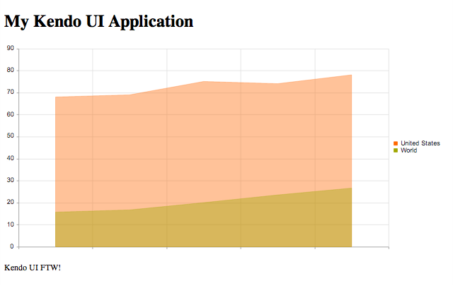

# How-To: Add Charts and Gauges with Kendo UI DataViz

In this how-to, we'll examine how to add charts and gauges to an application or site with [Kendo UI DataViz](http://www.kendoui.com/dataviz.aspx).

Let's begin by examining how to add a chart to an existing page. For this example, let's assume the following HTML:

	<!DOCTYPE html>
	<html lang="en">
	<head>
		<meta charset="utf-8">
		<title>My Kendo UI Application</title>
	</head>
	<body>
		<header>
			<h1>My Kendo UI Application</h1>
		</header>
		<!-- page content goes here -->
		

		

		<footer>
			
Kendo UI FTW!

		</footer>
	</body>
	</html>

The first step is to add script and stylesheet references for jQuery and Kendo UI DataViz:

	<!DOCTYPE html>
	<html lang="en">
	<head>
		<meta charset="utf-8">
		<title>My Kendo UI Application</title>

		<!-- CDN-based stylesheet reference for Kendo UI DataViz -->
		<link rel="stylesheet" href="http://cdn.kendostatic.com/2012.2.710/styles/kendo.dataviz.min.css">

	</head>
	<body>
		<header>
			<h1>My Kendo UI Application</h1>
		</header>
		<!-- page content goes here -->
		

		

		<footer>
			
Kendo UI FTW!

		</footer>

		<!-- CDN-based script reference for jQuery; utilizing a local reference if offline -->
		
		

		<!-- CDN-based script reference for Kendo UI DataViz; utilizing a local reference if offline -->
		
		

	</body>
	</html>

> Style and script references to Kendo UI are accessible via HTTPS. However, they are hosted on Amazon CloudFront. Please refer to the [JavaScript Dependencies of Kendo UI](http://docs.kendoui.com/getting-started/javascript-dependencies) for more information about script requirements for Kendo UI Web, Kendo UI DataViz, and Kendo UI Mobile.

The next step is to declare a target element for a chart. This will be represented by a `div` element. A script block is also required to initialize and configure the area chart. Here's an example for an area chart along with some sample data:

	<!DOCTYPE html>
	<html lang="en">
	<head>
		<meta charset="utf-8">
		<title>My Kendo UI Application</title>

		<!-- Kendo UI HTTP CDN style reference for DataViz -->
		<link rel="stylesheet" href="http://cdn.kendostatic.com/2012.2.710/styles/kendo.dataviz.min.css">

	</head>
	<body>
		<header>
			<h1>My Kendo UI Application</h1>
		</header>
		<!-- page content goes here -->
		

			<!-- chart/gauge -->
			

			

		

		<footer>
			
Kendo UI FTW!

		</footer>

		<!-- Google CDN reference for jQuery; utilizing a local reference if offline -->
		
		

		<!-- Kendo UI HTTP CDN script reference for DataViz; utilizing a local reference if offline -->
		
		

		

	</body>
	</html>

Here's how the page looks in the browser:

