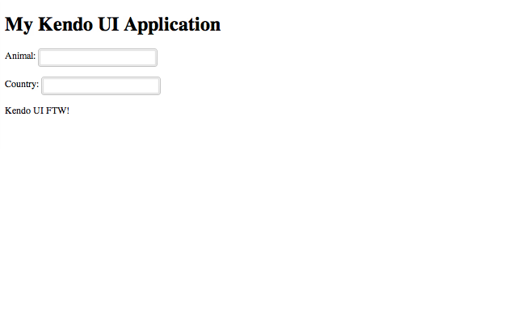

# How-To: Add Widgets with Kendo UI Web

In this how-to, we'll examine how to add widgets to an application or site with [Kendo UI Web](http://www.kendoui.com/web.aspx).

Let's begin by examining how to add a widget to an existing page. For this example, let's assume the following HTML:

	<!DOCTYPE html>
	<html lang="en">
	<head>
		<meta charset="utf-8">
		<title>My Kendo UI Application</title>
	</head>
	<body>
		<header>
			<h1>My Kendo UI Application</h1>
		</header>
		<!-- page content goes here -->
		

		

		<footer>
			
Kendo UI FTW!

		</footer>
	</body>
	</html>

The first step is to add script and stylesheet references for jQuery and Kendo UI Web:

	<!DOCTYPE html>
	<html lang="en">
	<head>
		<meta charset="utf-8">
		<title>My Kendo UI Application</title>

		<!-- CDN-based stylesheet references for Kendo UI Web -->
		<link rel="stylesheet" href="http://cdn.kendostatic.com/2012.2.710/styles/kendo.common.min.css">
		<link rel="stylesheet" href="http://cdn.kendostatic.com/2012.2.710/styles/kendo.default.min.css">

	</head>
	<body>
		<header>
			<h1>My Kendo UI Application</h1>
		</header>
		<!-- page content goes here -->
		

		

		<footer>
			
Kendo UI FTW!

		</footer>

		<!-- CDN-based script reference for jQuery; utilizing a local reference if offline -->
		
		

		<!-- CDN-based script reference for Kendo UI DataViz; utilizing a local reference if offline -->
		
		

	</body>
	</html>

> Style and script references to Kendo UI are accessible via HTTPS. However, they are hosted on Amazon CloudFront. Please refer to the [JavaScript Dependencies of Kendo UI](http://docs.kendoui.com/getting-started/javascript-dependencies) for more information about script requirements for Kendo UI Web, Kendo UI DataViz, and Kendo UI Mobile.

The next step is to declare a target element for a widget. Depending on the type of widget, this can be represented by a few different elements. Widgets may configured in the following two (2) ways:

* in a script block via a jQuery selector and configuration properties;
* or, with data-* attributes for configuration properties and via a call to kendo.init().

Here's an example for a pair of [AutoComplete](http://docs.kendoui.com/api/web/autocomplete) widgets along with some sample data:

	<!DOCTYPE html>
	<html lang="en">
	<head>
		<meta charset="utf-8">
		<title>My Kendo UI Application</title>

		<!-- CDN-based stylesheet references for Kendo UI Web -->
		<link rel="stylesheet" href="http://cdn.kendostatic.com/2012.2.710/styles/kendo.common.min.css">
		<link rel="stylesheet" href="http://cdn.kendostatic.com/2012.2.710/styles/kendo.default.min.css">

	</head>
	<body>
		<header>
			<h1>My Kendo UI Application</h1>
		</header>
		<!-- page content goes here -->
		

			<!-- AutoComplete widget; initialized and configured via jQuery selector -->
			
Animal: <input id="animalAutoComplete" />

			<!-- AutoComplete widget; initialized and configured via data-* attributes -->
			
Country: <input id="countryAutoComplete" data-role="autocomplete" data-source="countries" />

		

		<footer>
			
Kendo UI FTW!

		</footer>

		<!-- CDN-based script reference for jQuery; utilizing a local reference if offline -->
		
		

		<!-- CDN-based script reference for Kendo UI DataViz; utilizing a local reference if offline -->
		
		

		

	</body>
	</html>

Here's how the page looks in the browser:

