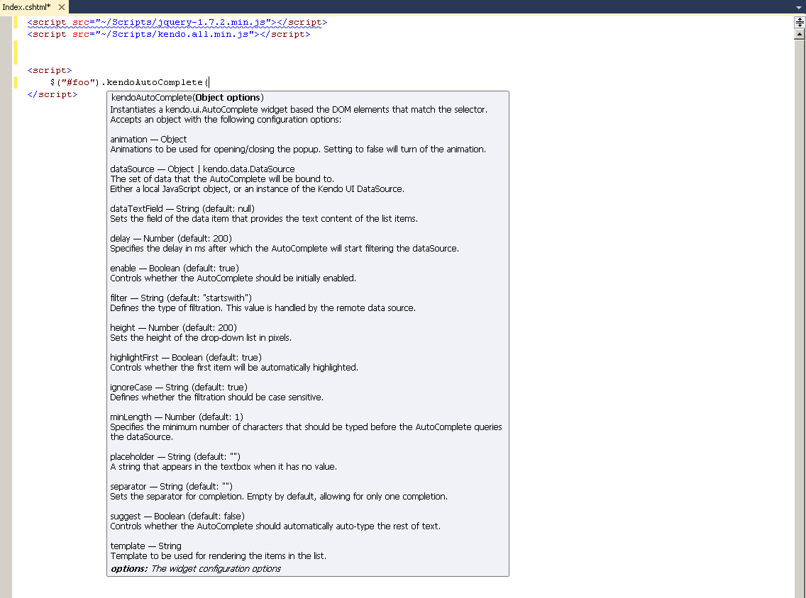
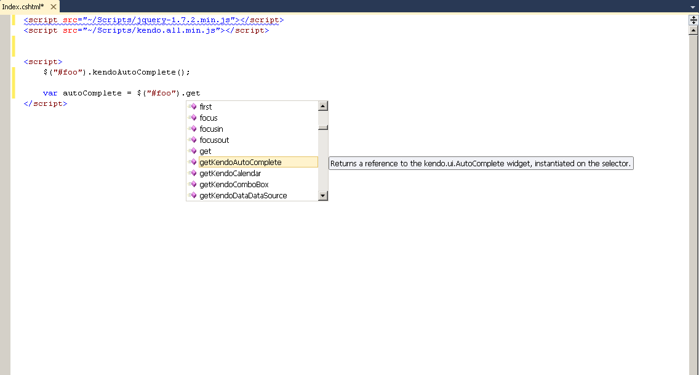
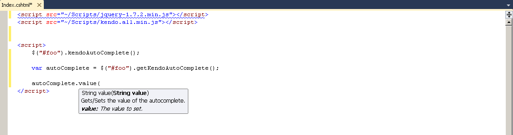
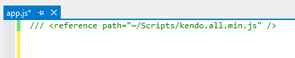

# KendoUI Visual Studio Intellisense

Kendo UI provides intellisense using an additional vsdoc javascript file. The approach was initially described in Scott Guthrie's blog post [jQuery Intellisense in VS 2008](http://weblogs.asp.net/scottgu/archive/2008/11/21/jquery-intellisense-in-vs-2008.aspx).
Visual Studio 2008 SP1 (or later) is needed. It also works with Visual Web Developer (free).

## Installation

Each bundle package contains a *vsdoc* directory, which contains a vsdoc.js file. Put the vsdoc file next to your kendoui bundle script in your project. Make sure its naming prefix matches the kendoui bundle name.

## Features

### Widget Initialization Configuration Options

### Widget accessors

### Widget Methods

## Referencing

There are two ways to reference the intellisense.

1. When the script is directly added to a page as shown above 
1. Using a reference hint from within an external JS file as shown below

